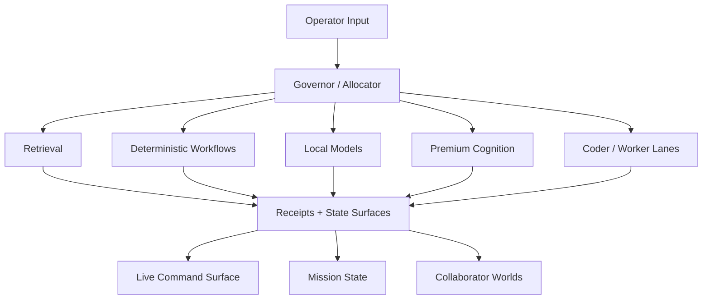
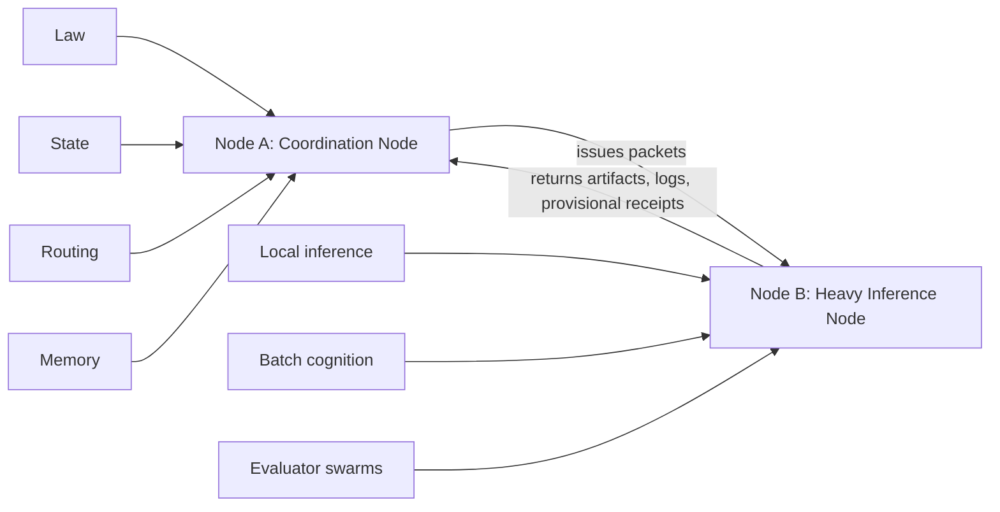
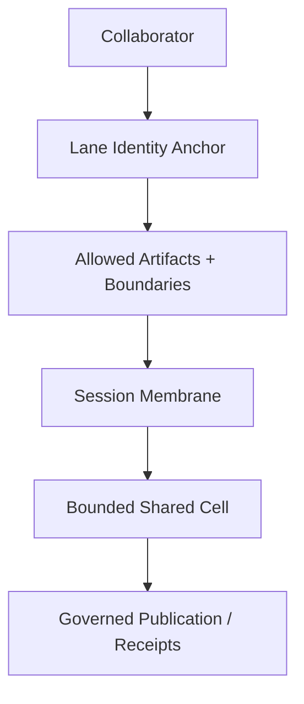

# Citadel Architecture Overview

This is the shortest architecture sketch of the system shown in this repo.

## Core idea

Citadel is not presented here as a single agent.
It is a governed operating system for intelligence work.

Its main architectural moves are:
- law before freeform autonomy
- routing before reasoning
- disk-backed state before hidden context
- membranes before undifferentiated access
- receipts before vague completion

## Simple map

## Authority split

Node A governs.
Node B executes.

## Collaborator-world map

A collaborator world is meant to be a designed chamber, not a generic thread.

## Read this next
- `README.md`
- `routing/GOVERNOR_ALLOCATOR_SPEC_V1.md`
- `routing/MODEL_ROUTING.md`
- `collaborator-worlds/COLLABORATOR_WORLD_ARCHITECTURE_V1.md`
