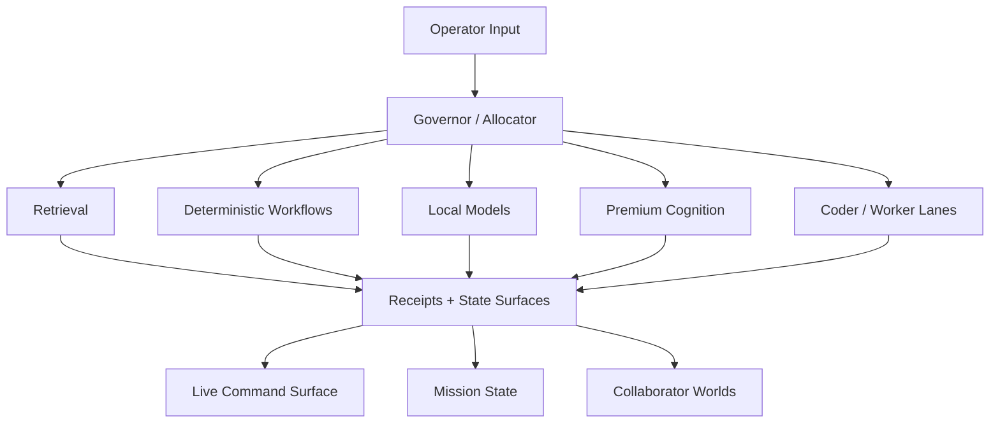

# Citadel Developer Tour Pack

A curated, public-safe tour of Citadel, a governed cognitive operating system.

Citadel is trying to make intelligence work **legible, routable, memory-backed, and governable** instead of leaving it as hidden agent behavior.

## Why this repo exists

This is not a full private system dump.
It is the smallest architecture slice that still lets a serious developer understand:
- what Citadel is
- how work gets routed
- how collaborator worlds differ from ordinary assistant chats
- where the real leverage is

## The shortest possible explanation

Citadel combines:
- **law** so the system has explicit operating constraints
- **state surfaces** so truth lives on disk instead of only in chat context
- **routing contracts** so tasks are assigned intentionally
- **bounded workflows** so autonomy stays observable and killable
- **collaborator membranes** so different people get designed worlds instead of generic access
- **authority separation** so coordination and heavy compute are not the same thing

## Architecture at a glance

For a slightly fuller version, read [`ARCHITECTURE_OVERVIEW.md`](./ARCHITECTURE_OVERVIEW.md).

## Fastest reading order

### 1. Core control surfaces
Read these first:
- `LAWS.md`
- `STATE.md`
- `LIVE_COMMAND_BOARD.md`

What to notice:
- the system is governed by explicit law
- active work is attached to live missions
- there is a distinction between doctrine, current state, and active command surface

### 2. Routing and execution architecture
Then read:
- `routing/GOVERNOR_ALLOCATOR_SPEC_V1.md`
- `routing/MODEL_ROUTING.md`
- `routing/WORKFLOW_ADMISSION.md`
- `routing/NODE_CONTRACTS.md`

What to notice:
- every task is supposed to be routed, not just handled ad hoc
- routing prefers deterministic -> retrieval -> local -> premium
- workflows need admission, observability, boundedness, and killability before they go live
- the persistent coordination node governs, while heavier compute is labor only

### 3. Collaborator-world architecture
Then read:
- `collaborator-worlds/COLLABORATOR_WORLD_ARCHITECTURE_V1.md`
- `collaborator-worlds/COLLABORATOR_LANE_TEMPLATE_V1.md`
- `collaborator-worlds/COLLABORATOR_LANE_IDENTITY_ANCHOR_SCHEMA_V1.md`
- `collaborator-worlds/COLLABORATOR_ROUTING_AND_SESSION_MEMBRANE_PROTOCOL_V1.md`
- `collaborator-worlds/COLLABORATOR_WORLD_MINIMUM_VIABILITY_STANDARD_V1.md`

What to notice:
- collaborator worlds are not generic user threads
- each lane has identity, boundaries, escalation, and allowed artifact surfaces
- routing, delivery, session visibility, and world quality are treated as different layers
- each collaborator lane is meant to be a designed chamber, not just a transport route

### 4. One genericized world instance
Finally read:
- `examples/generic-collaborator/identity_anchor.md`
- `examples/generic-collaborator/COLLABORATOR_OWNER_PUBLISHER_MEMBRANE_V1.md`
- `examples/generic-collaborator/SHARED_DEMO_CELL_CHARTER_V1.md`

What to notice:
- the lane explicitly remembers who it is for
- outward collaborator artifacts go through a governed publishing membrane
- shared cells are bounded by front, tone, and escalation rules

## If you only remember one thing

**Citadel is trying to make intelligence legible and governable.**

That is the real architectural center of gravity.

## Important note

This repo is a comprehension pack, not a runtime-complete system dump.
It is designed to let a developer sense the architecture quickly without exposing unrelated private context.

## Good questions to ask after reading
- Which parts are doctrine only, and which are runtime-enforced?
- What packet schema currently sits between routing and execution?
- How are receipts and state mutation enforced in practice?
- How are collaborator-lane permissions implemented today versus specified?
- Which parts of routing are already operational, and which remain design law?
